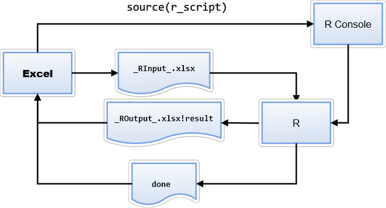

RRunner: Simple way of running R scripts from Excel VBA
#######################################################

This VBA module for Excel allows running R Scripts from Excel. You can send Ranges to your scripts and retrieve plots from them.

This is a much simpler solution than `RExcel <http://rcom.univie.ac.at/download.html>`_ or `BERT <https://bert-toolkit.com/>`_ (Basic Excel R Tookit). RRunner is simpler to install and, although it has less features, it provides enough functionality to leverage the power of R when you need Excel to perform specific tasks better suited for R (e.g. join multiple tables or perform statistical calculations).

This tool is also useful for beginners in R that typically use Excel and sometimes some VBA and want to start using R without entirely leaving the Excel environment. It also does not have a steep learning curve and the code is pure R (except for some boiler plate code at the beginning an some helper functions). The basic idea is to perform in Excel/VBA what is easy to do in Excel/VBA and use R for the tasks where R can shine, by calling an R script behind the scenes. This could also be a first step towards transitioning from Excel to R, since as you learn how to perform certain tasks in R, you might start performing more things in R and less things in Excel/VBA. 

   .. image:: ./images/IrisExample.gif
      :width: 100%
      :align: center

.. contents::

.. section-numbering::

Main features
=============

* Only the default R installation is required. No additional components are required to interact with R, although RStudio is recommended for the development of your scripts. 
* Enterprise-friendly: Administrative privileges are not necessary to use or install the module. Some enterprise policies do not allow exe files to be executed outside the ones white-listed, but policies are more relaxed for self-created VBA code. So RRunner comes handy in these situations where both R and Excel are standard and approved packages within the enterprise.
* Workbooks are also easily portable from one computer to another, as long as the r subfolder is also copied along and the destination system has also R installed, although R installation is not required to only view the Excel files.
* The R Console is used transparently to launch the R scripts, so all output messages are displayed on it. Some antivirus prevent running external files from within Excel. By pre-launching the R Console manually, we can avoid a false positive alert.
* The ranges are sent and retrieved to R through temporary Excel files that you can use while you develop your scripts, independently of the original Excel. This means that you can develop and debug your scripts in R Studio and finally integrate them with Excel. 
* Static plots from an Excel range can be generated in R and then displayed back in Excel 
* Sample programs demonstrating the different functions
* Currently only 32-bit Excel is supported, although R can be either 32 or 64 bits.

Installation
============

1. Make sure you have R installed (https://cran.r-project.org/bin/windows/base/)
2. Make sure you have the libraries readxl and writexl installed. Most likely you will want to install the tidyverse libraries as well. 
3. Launch the R Console. The console has to be running for RRunner to work. It can be minimized, though.
4. Import the RRunner.bas module into your Excel project or copy and paste everything (except the first line) into a new module.
5. Make sure you have checked *Microsoft Scripting Runtime* in your Project References.

   .. image:: ./images/ms_scripting_runtime.PNG
      :width: 100%       
      :align: center

VBA library usage
=================

Configuration
+++++++++++++++++++++++
You can leave the default configuration parameters as they are. By default, the R scripts will be searched in the subfolder "R" of the same folder as the Excel file and they will be allowed 10 seconds to execute before assuming timeout. The interface files between Excel and R will are called _RInput_.xlsx and _ROutput_.xlsx and will be created in the ".\\tmp" folder.
If you modify WORKING_PATH, it can be an absolute or relative path without the ending "\\". If using relative paths, they are relative to the folder where the Excel file is located. By default, the scripts are searched in the ".\\r" folder. When the R script finishes, it should generate a "done" file to tell VBA that the process has finished.

.. code-block:: VB

   ' ###################################################################
   ' Configuration Parameters
   ' ###################################################################
   ' Path to the R Scripts and where the temporary files will be created
   Private Const R_SCRIPTS_PATH = ".\r"
   Private Const WORKING_PATH = ".\tmp"
   ' Time to wait for the R Script answer in milliseconds
   Private Const TIMEOUT_MILLISECONDS = 10000
   Private Const R_IN_FILE_NAME = "_RInput_"
   Private Const R_OUT_FILE_NAME = "_ROutput_"
   ' ###################################################################
   

RunR2Range
+++++++++++++++++++++++

.. code-block:: VB
   
   RunR2Range(script As String, RangeToImport As Range, ParamArray RangesToExport() As Variant) As Boolean

This function accepts the name of the script (just the name, including the extension), a range where the result will be placed (just the top-left corner cell needs to be indicated) and a set of name-ranges pairs.

Example:

.. code-block:: VB

   Set Range1 = ActiveWorkbook.Worksheets("Data1").Range("A:C")
   Set Range2 = ActiveWorkbook.Worksheets("Data2").Range("A:B")
   If RRunner.RunR2Range("SampleJoin.r", Range("calculated_values"), "table1", Range1, "table2", Range2) Then
       MsgBox "Done"
   End If
 
This will generate an _RInput_.xlsx file with two sheets (they will be called "table1" and "table2" respectively) that will contain the data of Range1 and Range2 and SampleJoin.r script will be called. The script should output the result in a file called _ROutput_.xlsx in a sheet called "result" (this is hardcoded in the module). The data will be then read from this sheet and placed starting at the top-left corner of the named range called "calculated_values".
Note that although the ranges are referred as the whole columns, only the rows up to the used range will be sent to R. 

RunR2Plot
+++++++++++++++++++++++

.. code-block:: VB
   
   RunR2Plot(script As String, RangeToExport As Range, ChartToLoad As ChartObject, PlotName As String) As Boolean

This function accepts the name of the script (just the name, including the extension), a range from which to read the data and a ChartObject in which to insert the generated chart image. To insert an empty ChartObject, just click on any empty cell, and go to Insert and select any chart type. You can then give a name to this area selecting it and using the usual Name Box (the input box directly to the left of the formula bar).

Example:

.. code-block:: VB

   Set ws = ActiveWorkbook.Worksheets("Data1")
   RRunner.RunR2Plot "SampleChart.r", Range("MyPlotData"), ws.ChartObjects("MyChart"), "mychart"

This will generate an _Input_xlsx file with one sheet containing the data in the Named Range "MyPlotData". The sheet will be called "mychart". The R script "SampleChart.r" will be called and it is expected to generate a png file called mychart.png, which will be inserted in the Chart Object "MyChart" after removing any existing image.

RunRScript
+++++++++++++++++++++++++++++

.. code-block:: VB
   
   RunRScript(RangesToExport As Dictionary, RangesToImport As Dictionary, PicturesToImport As Dictionary, script As String) As Boolean

This function is the generalisation of the other two. The input ranges are sent as dictionaries using the name as key and the value the actual range.

R library usage
=================

Initialization
+++++++++++++++++++++++++++++

.. code-block:: R

   # Check if RStudio is running to set the working directory to the script directory
   # https://stackoverflow.com/questions/35986037/detect-if-an-r-session-is-run-in-rstudio-at-startup
   is.na(Sys.getenv("RSTUDIO", unset = NA))
   if (!is.na(Sys.getenv("RSTUDIO", unset = NA))) {
     # Get current directory
     current_dir <- dirname(rstudioapi::getSourceEditorContext()$path)
     # Set working directory to current directory (script directory)
     setwd(current_dir)
   } else {
     # If sourced https://stackoverflow.com/questions/13672720/r-command-for-setting-working-directory-to-source-file-location-in-rstudio
     this.dir <- dirname(parent.frame(2)$ofile)
     setwd(this.dir)
   }
   # Include the excel helper functions
   source("excelhelper.r")

This piece of code should be at the beginning of your R Code. It sets the working directory to the script directory. This is necessary since the input and ouput files are looked in this folder. The above code will work both in RStudio and when called from VBA through the R Console using source().
The last line includes the functions inside "excelhelper.r" which help reading and writing data.

The template.r provides a good starting point for your scripts.

getTable
+++++++++++++++++++++++++++++

.. code-block:: R

   getTable <- function(tableName) {
     read_excel("../tmp/_RInput_.xlsx", sheet = tableName)
   }

This is defined in excelhelper.r and allows reading a range into a dataframe using readxl

Example:

.. code-block:: R

   table1 <- getTable("table1")

writeResult 
+++++++++++++++++++++++++++++

.. code-block:: R

   writeResult <- function(tablenames, col_names = TRUE) {
     write_xlsx(tablenames, path = "../tmp/_ROutput_.xlsx", col_names = col_names, format_headers = FALSE)
   }

This is defined in excelhelper.r and allows writing a dataframe into the output file using writexl. Column names are displayed by default.

Example when returning just one dataframe (res in the example). The generated sheet should be called "result":

.. code-block:: R

   writeResult(list("result" = res))

saveChart 
+++++++++++++++++++++++++++++

.. code-block:: R

   saveChart <- function(name,  pxwidth = 1024, pxheight = 768, dpi=150) {
     ggsave(filename = paste("../tmp/",name,".png",sep = ""),dpi=dpi, units="in", width=pxwidth/dpi, height=pxheight/dpi)
   }}

This is defined in excelhelper.r and allows writing a ggplot2 plot as png file. By default it will be saved with a size of 1024x768 pixels.

Example:

.. code-block:: R

   saveChart("myplot")

done
+++++++++++++++++++++++++++++

.. code-block:: R

   done <- function() {
     file.create("../tmp/done")
     closeAllConnections()
   }
     
   
This should be called at the end of your script. It generates a file that signals that the process has ended and VBA can then retrieve the data safely.

Example:

.. code-block:: R

   done()
   
   
Tips
====================================

1. Start with the default template and rename it as needed, placing it in an "r" subfolder of the folder where your Excel file is located.
2. Copy excelhelper.r to the "r" folder created in step 1.
3. Write the piece of code in VBA what will call your script first to get some data in the tmp folder before coding your R script. Remember to open the R Console. Although the execution will timeout, the export of the required ranges will be performed. 
4. Once you have the data in the tmp folder, create your script with RStudio modifying the file of step 1. 
5. Test your script in RStudio first commenting out the rm(list=ls()) to be able to see the content of the variables at the end of the execution.
6. Finally test the integration with Excel and uncomment the rm(list=ls()) line.
